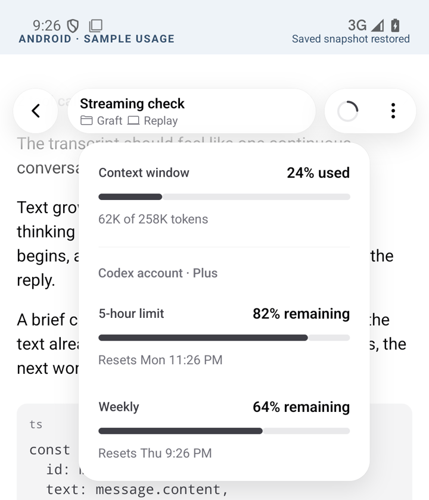
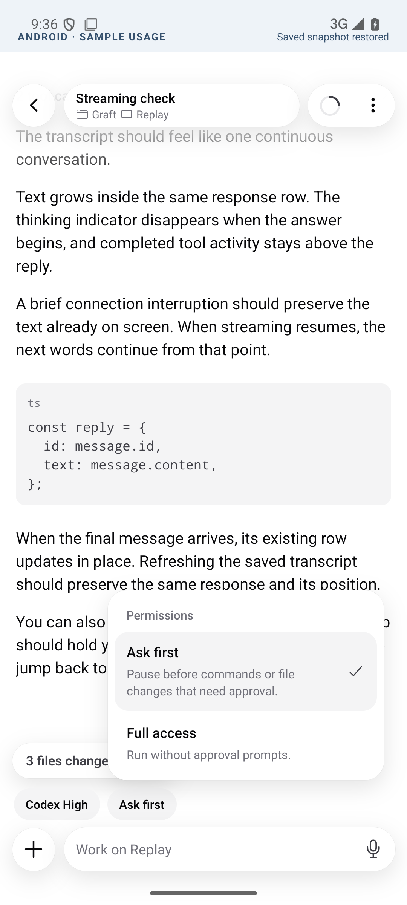
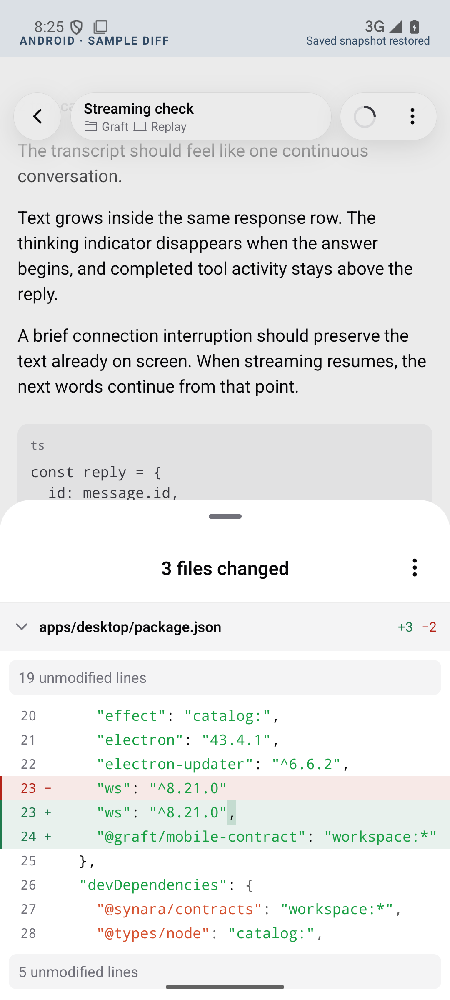

# Android chat UX review

## Behavior

Streaming keeps each assistant message in one row through deltas, completion, and saved-snapshot replacement. The original 5×5 dot loader has one live-status owner. Received text is coalesced for 32 ms, with no additional typewriter queue. Reconnection, thinking, and tool-only changes do not reset the reader's scroll position.

The compact header retains the circular context button. Its rounded menu shows context, five-hour allowance, and weekly allowance as horizontal bars when the host reports them. Permissions, effort, model, composer options, and overflow share the anchored menu surface, including Back/outside dismissal and keyboard/draft preservation.

The draggable diff sheet opens at half height, with collapsible file headers, change totals, syntax-colored line changes, inline emphasis, and unmodified-line gaps. File details load on expansion. The first 200 lines are shown, with more available in 200-line increments; server previews are bounded to 1,200 lines or 180,000 characters. Omitted context is labeled, not fetched.

## Native recordings

These recordings use the real Android components in an isolated proof app on an Android 15 / API 35 emulator. Events, usage values, and diff content are deterministic fixtures. They demonstrate rendering and interactions, not live provider latency or the state of an installed phone build. Playback timing is unchanged.

- [Streaming and restored dot loader](streaming.mp4): includes a simulated connection pause, completion, and snapshot replacement. This was recorded before the compact-header follow-up.
- [Final menus and usage bars](menus.mp4): context and allowance, permission selection, effort, and model picker.
- [Diff sheet](diff-viewer.mp4): partial/full-height presentation, file switching, horizontal scrolling, rounded options, and dismissal.

## Verification

- Android Vitest: 99 tests passed.
- Mobile gateway, usage, and diff tests: 21 passed.
- Shared context behavior through the web re-export: 18 passed.
- Mobile contract: 20 passed; iOS protocol fixtures remain in sync.
- Mobile boundary check, frozen lockfile install with Bun 1.3.12, and `git diff --check` passed.
- Android release builds and production Expo bundle export passed during implementation. Native checks covered streaming settlement, menu selection/dismissal, keyboard retention, and diff-sheet interaction.

The web context utility is moved unchanged into the shared package. Host additions are necessary for reliable reconnect text, measured context, account allowance, and patch details. Older hosts retain unavailable-data states instead of invented usage.

iOS behavior is mirrored in source; Xcode build/test validation remains pending on this Linux host. Full workspace formatting, linting, and typechecking have not been run because repository instructions require an explicit request. No phone or host release has been published.

This change targets `codex/graft-synara-migration`, which provides the mobile applications and compatibility gateway; that prerequisite is not yet in `main`.
