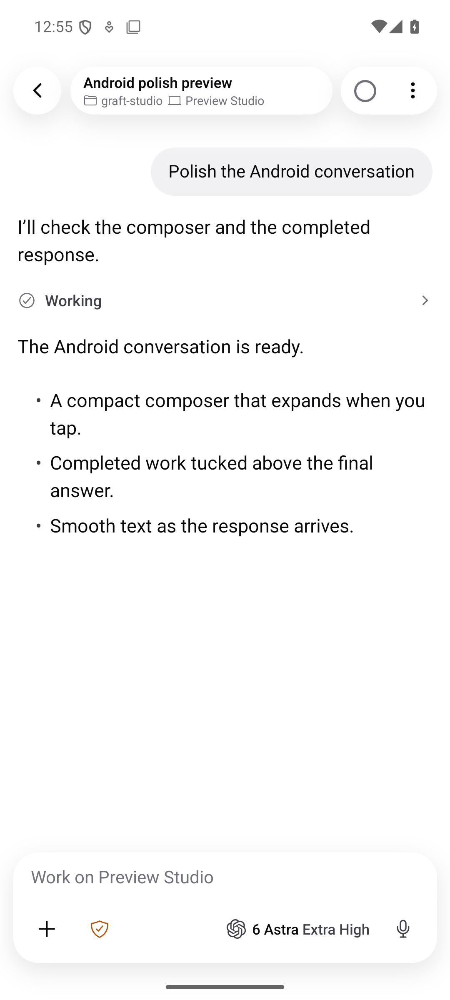
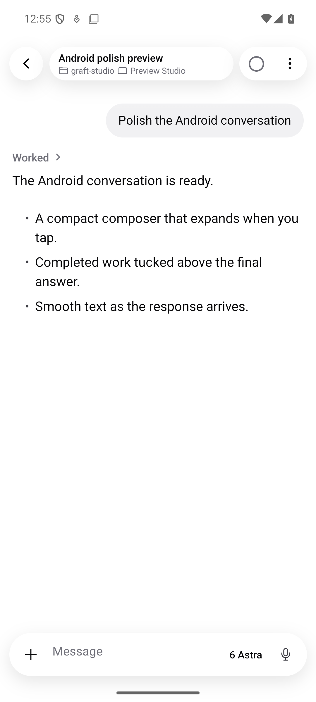

# Android composer and completed-response polish

Verified on an Android 15 x86_64 emulator using a release-mode, isolated fixture
(`studio.graft.mobile.polishproof`). No paired host or user conversation was used.
The same fixture compares `f1b3d572d` with the changed composer and transcript.

| Before                                                    | After                                             |
| --------------------------------------------------------- | ------------------------------------------------- |
|  |  |

[Expanded editor](expanded.png) · [Collapsed draft](draft-pill.png) · [Expanded work details](work-details.png) ·
[32-second composer and streaming recording](motion.mp4)

## Observed behavior

- Idle: single pill, plus, model name, microphone. No provider mark, effort suffix,
  or permissions badge. Plus → Permissions still exposes the configured policies.
- Focus: the same input expands above the keyboard; dismissing the keyboard returns
  to the pill with the draft intact. Model, dictation, and send controls remain inside.
- Completion: a collapsed "Worked" disclosure contains the earlier commentary and
  tool rows. Expanding it retains the original final answer underneath. Android
  deliberately uses the iOS fallback label without an elapsed duration.
- Stream: new prose fades over 180ms with no artificial character backlog. Existing
  text stays solid. Reduced motion and completed/corrected content bypass the fade.
  Structured results and errors stay visible outside the fold.

## Verification

- `bun run fmt:check`: passed.
- `bun run lint`: passed, with existing repository warnings and no errors.
- `bun run typecheck`: all 12 workspace tasks passed; Android typecheck repeated
  after the final reconciliation change.
- `bun run android:test`: 226 tests passed, including editor identity, permission
  access, turn folding, preserved row identity, bounded reveal spans, ordinary-paragraph fades, and haptic cadence.
- Local Gradle debug and release builds succeeded; release fixture opened and
  streamed without React Native or Android runtime errors.

Haptic dispatch is tested (at most three frequent-segment ticks per run, 1.2s apart,
foreground/connected/following only). An emulator cannot verify physical haptic
strength or on-device frame pacing; those still require the installable preview on
an Android phone. The fixture verifies UI behavior, not a live provider request.
