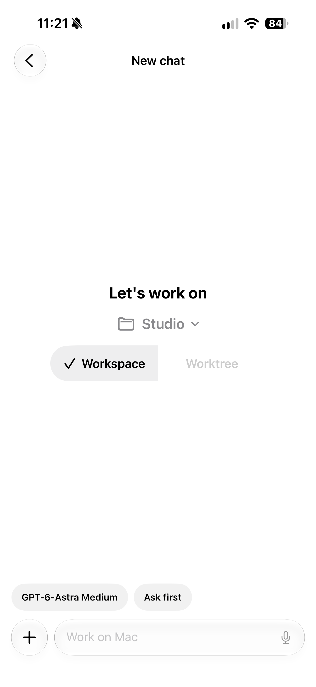
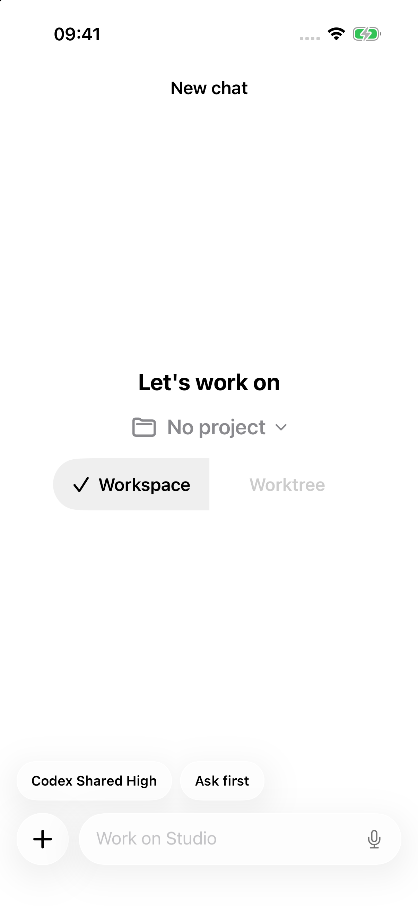
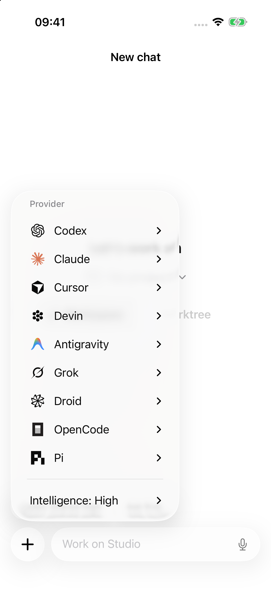
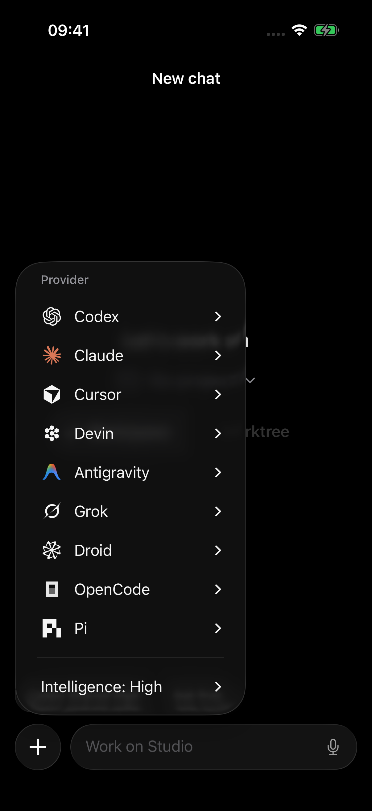

# iOS desktop parity: review and verification

This change collects the remaining mobile work from the iOS testing session on
top of `main` at `a85dfa002`. Commits separate onboarding, shared protocol and
gateway behavior, Android parity, and native iOS presentation. Existing mobile
attachments, provider locking, dictation, and diff-file previews remain integrated.

## Review order

1. `packages/mobile-contract/src/index.ts` and the matching TypeScript/Swift
   fixtures: additive task, skill, file, effort, and completion metadata.
2. `apps/server/src/graftMobile`: command dispatch concurrency, structured
   commands, workspace file access, and current working changes.
3. `apps/ios/Graft/Stores`: streaming completion, history, task progress, and
   host-confirmed model selection.
4. `apps/ios/Graft/Views`: transcript formatting, skill/file links, floating
   controls, provider marks, and Liquid Glass model settings.
5. `apps/mobile-android`: matching shared task, command, and transcript behavior.

The generated Xcode project registers the new native source and fixture files.
Provider assets reuse the desktop marks; the Antigravity raster exports preserve
its masked and blurred layers. The large native visual test files exercise
synthetic transcripts and model controls, without requiring a provider login.

## Automated checks

Run on September 16, 2026, with Bun 1.4.2 and Node 24.19.0:

| Check                                            | Result                                                                 |
| ------------------------------------------------ | ---------------------------------------------------------------------- |
| `bun run fmt:check`                              | Passed                                                                 |
| `bun run lint`                                   | Passed: 0 errors, 606 warnings                                         |
| `bun run typecheck`                              | Passed: all 12 package tasks                                           |
| `bun run test`                                   | Passed: all 12 workspace tasks; 11,872 Vitest cases passed, 30 skipped |
| `bun run --cwd apps/server test src/graftMobile` | Passed: 147 tests across 21 files                                      |
| `bun run windows-runtime:check`                  | Passed: 241 files checked                                              |
| `git diff --check`                               | Passed                                                                 |

The first broad test run exposed a race in the LAN gateway shutdown test. The
test now waits for an actual forwarded health request before shutdown and checks
that any socket error is the expected `ECONNRESET`. The focused test and the full
workspace rerun passed. No test assertions were removed or skipped for this PR.

### Native verification

Native verification uses Xcode 27 beta (`27A5194q`) and an isolated iPhone 17 Pro
simulator running iOS 26.5. The signed app and test bundle build successfully.

The full native run completed 241 tests: 240 passed, one failed, none skipped.
The failure was a stale diff-sheet fixture expecting `Focused diff`; the current
sheet displays `1 file changed`. The assertion now checks that exact intended
label and retains its keyboard-dismissal, activation, count, and file-path checks.
Its focused rerun passed (1/1), covering all 241 unique native tests across the
full run and correction. All ten model-settings visual tests passed in the full
run. There was no further full-suite rerun after this one-line test correction.

Earlier attempts exposed unsigned Keychain errors and an inactive simulator
accessibility tree. Normal simulator signing and accessibility initialization
resolved those failures without changes to production code or skipped assertions.

## Visual evidence

The before image is the user's new-chat screenshot before the latest provider
logo and glass-pill polish. It is not a reconstruction of pristine `main`.
After captures use the integrated branch and synthetic catalog/transcript data.

| Before the latest polish                                                      | Integrated new-chat controls                                                |
| ----------------------------------------------------------------------------- | --------------------------------------------------------------------------- |
|  |  |

| Provider menu, light                                     | Provider menu, dark                                    |
| -------------------------------------------------------- | ------------------------------------------------------ |
|  |  |

The [quick effort control](quick-effort-dark.png) replaces the composer area;
the [Advanced sheet](advanced-dark.png) groups Model, Intelligence, and supported
Speed settings. Native taps verified provider submenus, model selection, and
permission selection. All nine provider marks rendered in both themes.

The [22-second interaction recording](provider-controls.mp4) shows the native
provider menus and selection controls. Playback is accelerated to shorten pauses;
it should not be used to assess the exact animation duration. No private chat or
physical-device recording is included.

## Verification limits

Simulator interactions verify native rendering and control behavior. Fixture
tests verify event handling and host response reconciliation. They do not prove
live-provider authentication, a physical camera feed, or remote connectivity.
This PR integration was not installed on the physical iPhone during PR assembly.
The Windows check is a static boundary check, not a packaged Windows runtime test.
