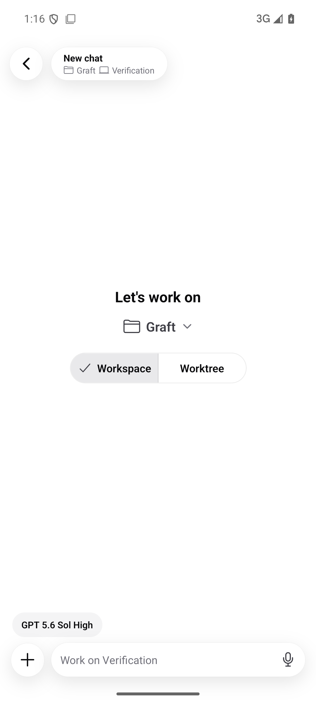
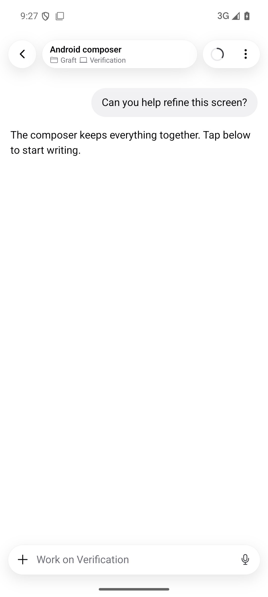
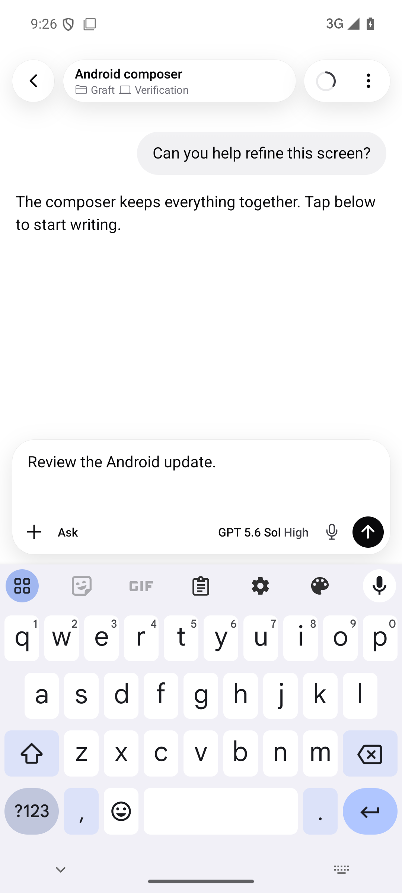

# Mobile chat controls

These Android emulator captures use an isolated test package and local fixture data.
The idle, expanded, model-menu, and keyboard-dismissed captures show the final
integration onto main. The previous composer, dictation, and attachment captures
come from earlier device verification in the same change set.

| Previous composer                                           | Unified idle composer              | Expanded composer                                     |
| ----------------------------------------------------------- | ---------------------------------- | ----------------------------------------------------- |
|  |  |  |

## Interaction states

- [Composer interaction video](composer.mp4) (22 seconds; inspection pauses removed)
- [Model and effort menu](model-menu.png)
- [Plus menu with attachments, modes, and speed](plus-menu.png)
- [Keyboard and menu dismissed together](keyboard-dismissed.png)
- [Dictation with aligned controls](dictation.png)
- [Long draft with an attachment and visible new-chat controls](attachments.png)

The video covers the normal composer flow before the final keyboard-dismissal
follow-up; the keyboard-dismissed screenshot verifies that correction.

The composer expands on focus using the shared 220 ms ease-out disclosure timing,
grows with the draft, and respects reduced motion. Its text input remains mounted
while recording and while switching between compact and expanded layouts.

The chat header retains PR14's ring, chevrons, and control sizes, with the row
positioned below the device safe area. Files, Photos, Camera, Plan, Debug, and
supported Fast mode are available from the plus menu. Existing conversations lock
the provider while keeping models and effort within that provider selectable.

## Verification

- Android: 132 tests passed on the integrated main branch.
- Mobile host: 103 tests passed.
- Mobile protocol: 21 tests passed.
- Shared web context/disclosure consumers: 23 tests passed.
- Protocol fixture and iOS local-network checks: 9 tests passed; 34 fixtures in sync.
- Android production JavaScript/Hermes export passed.
- Native Android build passed on main's updated Expo dependencies. The final
  emulator smoke verified a 46 dp idle composer, 118 dp focused card above the
  keyboard, draft entry, effort selection, plus actions, and collapse. Header
  controls remained 44 dp. Dismissing the keyboard closes its open menu too.
- Earlier native checks covered picker actions, attachment upload/cancel, dictation
  start/cancel, keyboard behavior, long drafts, and reduced motion. Spoken-word
  recognition accuracy was not tested with live audio.

The microphone and attachment modules require a new APK. The preview profile
builds a standalone release APK for the existing EAS project; it permits local
HTTP hosts for testing. Production retains the HTTPS-only policy.
