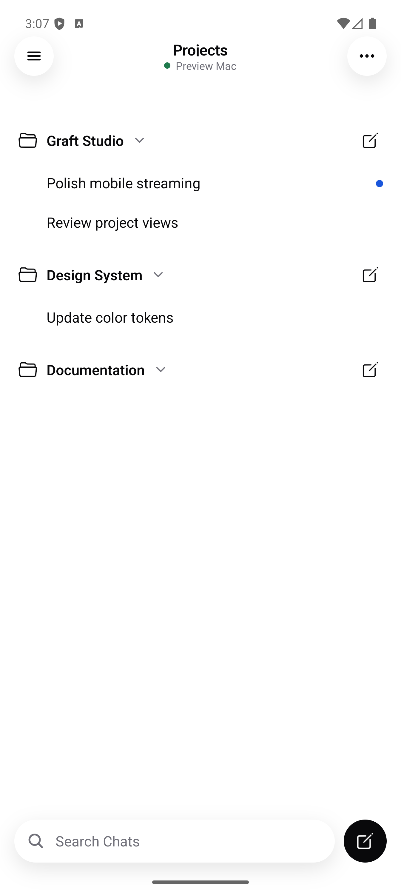
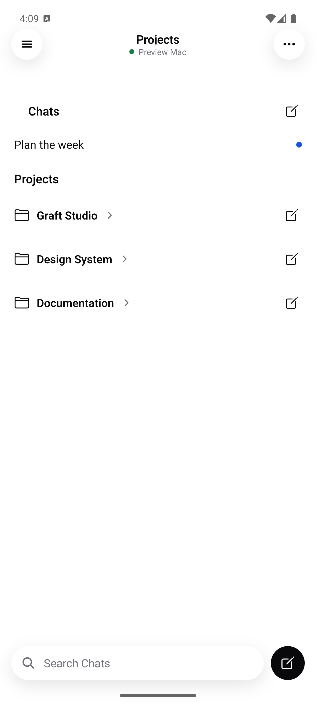

# Mobile inbox verification

The implementation is based on the merged PR #69 (`45800e1ac`). Inbox behavior is in
`6f8333a40`; `56f384263` fixes array sorting on the installed Hermes runtime.

## UI comparison

These emulator captures use sample projects and conversations. The earlier
Android preview expands every repository folder and uses a dot for active work;
the updated inbox separates Chats, collapses repository folders, and distinguishes
working spinners from unread response dots.

| Earlier Android inbox                            | Updated Android inbox                                       |
| ------------------------------------------------ | ----------------------------------------------------------- |
|  |  |

[Working spinner and unread dots](android-working.png) ·
[iOS layout](native-chats-projects.png) ·
[iOS walkthrough](ios-inbox.mp4) · [Android walkthrough](android-inbox.mp4)

## Behavior

- By Project starts with collapsed repository folders and a separate Chats section.
- The overflow menu selects Priority, By Project, or Chronological and retains the choice.
- Recents appears in the phone drawer on both platforms and in the persistent iPad panel.
- Working threads show a spinner. Completed responses that have not been opened
  on this device show a blue dot. Requests needing input use an attention icon.
- Read receipts persist per paired computer. Opening the loaded transcript while
  foregrounded clears its dot; reconnect/replay does not restore an already read dot.
- Clients keep independent connections to every paired computer. All merges the
  inbox; computer chips filter without disconnecting other machines. An offline
  computer shows a red dot and cached content without stale progress or warnings.
  Add computer is available in Projects → ⋯ and Settings → Computers.
- The multi-computer follow-up's checks and native verification gaps are recorded
  in [its review notes](../mobile-multi-machine/README.md). The captures and counts
  below describe the earlier inbox work.

## Automated checks

- Android: 258 tests across 43 files passed, including view switching, Chats,
  search/collapse state, activity classification, completion replay, persistence,
  foreground handling, computer isolation, and Hermes-compatible sorting without snapshot mutation.
- iOS: 47 grouping/protocol/adaptive tests passed on iPhone; the rendered inbox
  test passed on iPhone and iPad; all eight iPad adaptive checks passed.
- Mobile contract and server protocol adapter: 22 tests each passed.
- Workspace typecheck: all 12 tasks passed.
- Lint: zero errors, 621 existing warnings.
- Full repository test run: 12,138 passed; one failure in
  `apps/server/src/legacyGraft/importService.test.ts:322`, expecting `missing`
  and receiving `outside-approved-roots`. The same failure was reproduced in a
  separate checkout of unchanged `45800e1ac`.
- Format check: blocked by 40 pre-existing `.omx` JSON files; changed source files pass.

The full suite ran before the last two Android regression tests were added;
the final Android suite and workspace typecheck include those changes. Native screenshot fixtures use sample data.

## Installed iOS walkthrough

[iOS video](ios-inbox.mp4) uses a simulator paired with an isolated sample host.
The live flow verifies collapsed projects and Chats, switches to Priority,
observes Working change to Unread response after a successful completion,
opens the loaded response, returns to confirm its dot clears, and opens Recents.
A separate stop/relaunch confirms the read state and view selection persist.
The signed physical-device build succeeded and was installed on Brent’s
iPhone 17 Pro Max on September 20, 2026. Remote launch timed out; open Graft
on the phone to exercise the installed update.

## Test on Android

The [signed preview build](https://expo.dev/accounts/brentmwarner/projects/graft-mobile-android/builds/76f7b55d-5c6c-45a9-a071-09ede3edacd5)
contains the merged Android changes and the new inbox.
[Download the APK](https://expo.dev/artifacts/eas/zfNsEDbsdZU0dVLUn-JB7_XE8PVwDwP72fb2Aa2udRA.apk)
on an Android phone and install it. This preview runs without Metro.

The signed APK was installed over the earlier preview on an isolated Android 16
emulator, retaining its pairing. The [Android video](android-inbox.mp4) uses the
same sample host as the iOS walkthrough. It shows all three view modes,
collapsed folders, Chats, Recents navigation, a working spinner becoming an
unread dot, clearing the dot by opening the response, and persistence after
relaunch. Screenshots were inspected as well as accessibility assertions;
selectors were adjusted for project metadata and the mounted drawer. The final process log had no React Native JavaScript errors or app crashes;
it did contain Android platform startup diagnostics. Physical Android haptics remain
a manual device check.

APK SHA-256: `4e8a4b6d5a8c37afb158bd5eeaa972e7c5db369548633db330bcd74a592e604f`.
The signing certificate matches the earlier preview, so updating does not
require uninstalling or clearing the pairing.

1. Open Projects: folders should be collapsed, with Chats above them.
2. Expand one folder, open a thread, return, and switch view modes. Manual folder
   expansion should be retained. Relaunch and check the selected view is retained.
3. Search for a thread inside a closed folder: the matching thread should appear.
   Clear search: the original folder expansion should return.
4. Open the drawer and select a thread from Recents.
5. Start a response, return to the inbox, and watch the spinner. On successful
   completion it becomes a blue dot. Open the thread and return: the dot clears.
6. Repeat after relaunching, in dark mode, and with larger system text.

Hosts with `lastCompletedAt` support completions missed while offline. Older
hosts support successful live completions observed by the app. Haptic feel
requires a physical device; simulator results do not verify the vibration.
