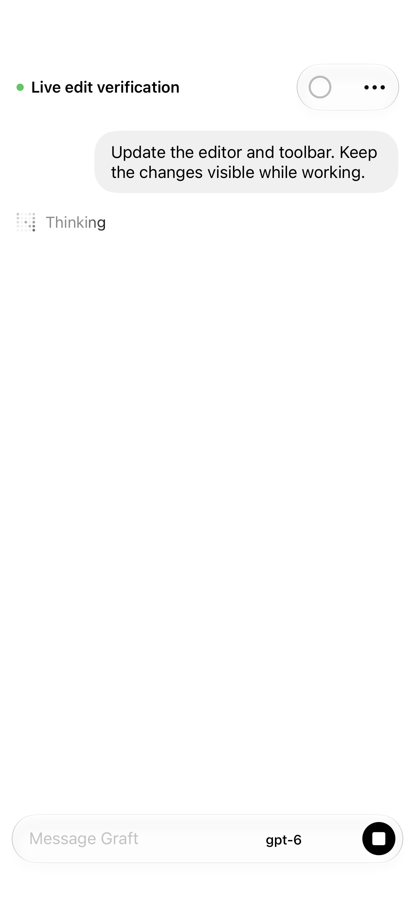
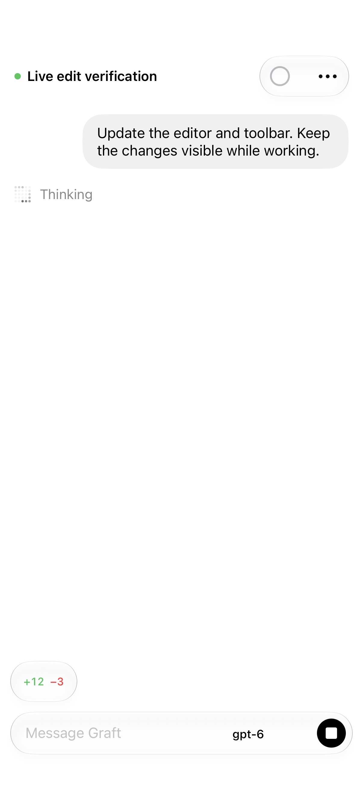
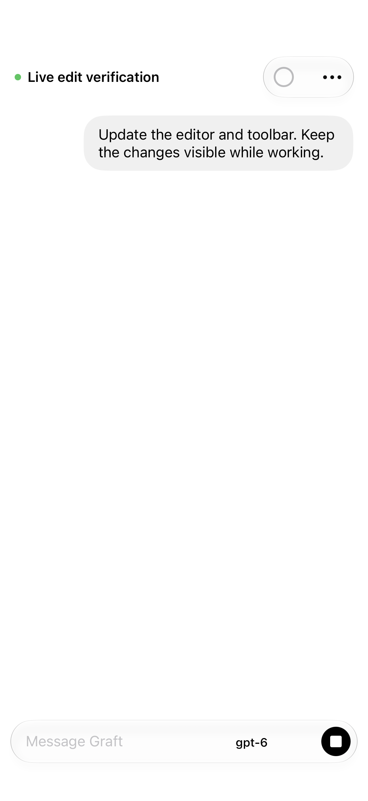
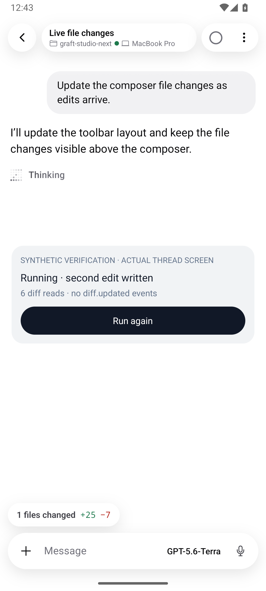

# Live file-change pills on mobile

The composer now reads the working-tree summary while the visible thread is running. Each read finishes before the next two-second interval starts. Returning from the background or reconnecting refreshes immediately; settling the turn performs a final read and stops polling. These updates do not trigger transcript auto-follow.

## Regression evidence

The Android `ThreadScreen` regression test starts with an empty working tree, changes the response during a running turn without emitting `diff.updated`, and expects the pill to appear. Before the change it failed because the pill remained absent. With the fix, the same test sees the pill appear, its count increase, and the final empty response remove it. Separate tests cover background/offline/unmount cleanup, slow reads, and stale responses.

Four native iOS tests use the real `ThreadView`, `ChatModel`, and command-response pipeline with a synthetic gateway transport. The visible thread goes from no changes to +3/−1 and then +12/−3 before completion, without a `diff.updated` event. Tests also cover cancellation, stale replies, and overlapping requests to open changes. Screenshots and rendered-text assertions verify the pill. This is native UI verification with synthetic data, not a live provider editing a repository.

| Running, no edits yet          | Running, edits received                          | Completed, clean working tree    |
| ------------------------------ | ------------------------------------------------ | -------------------------------- |
|  |  |  |

## Checks

- Android: all 304 tests passed on the isolated implementation commit; its typecheck passed.
- iOS: four native regression tests passed.
- Workspace lint and typecheck passed.
- Full workspace tests encountered a five-second dynamic-import timeout in the unchanged web `ChatMarkdown` test. That file's 61 tests passed when run separately; the full run is not claimed green.
- Root formatting reports 45 pre-existing generated `.omx` state files. Changed files pass formatting.

Implementation commit: `d8a68e9d0`, based on main `5cade3e72` (PR 77).

The signed iOS Release from this commit was installed on Brent’s iPhone 17 Pro Max. Automatic launch was blocked because the phone was locked; physical-device interaction has not been reverified.

A local EAS preview APK was built from the same commit. Signature and archive integrity passed; the full LAN download matched SHA256 `adaa5d80d0407df3d9730891185ef41c3b3878efe094946e4f2df43e2d4cae0f`. No cloud build credits were used.

## Android recording

[Native Android demonstration](android-live-diff.mp4) shows the actual ThreadScreen reading synthetic working-tree data: initially empty, then +12/−3, then +25/−7 during the same active run, and finally no pill when the turn ends with a clean tree. No `diff.updated` event is emitted. The composer remains in place. The fixture runs on an isolated API 36 emulator.

An existing singular-label issue remains visible: the Android pill says “1 files changed”. This change addresses refresh behavior.

The exact signed preview APK cold-launched on the isolated Android emulator with Metro stopped and port forwarding removed. The pairing screen rendered, the process remained alive, and logs contained no fatal native/JavaScript or missing-module startup errors.
