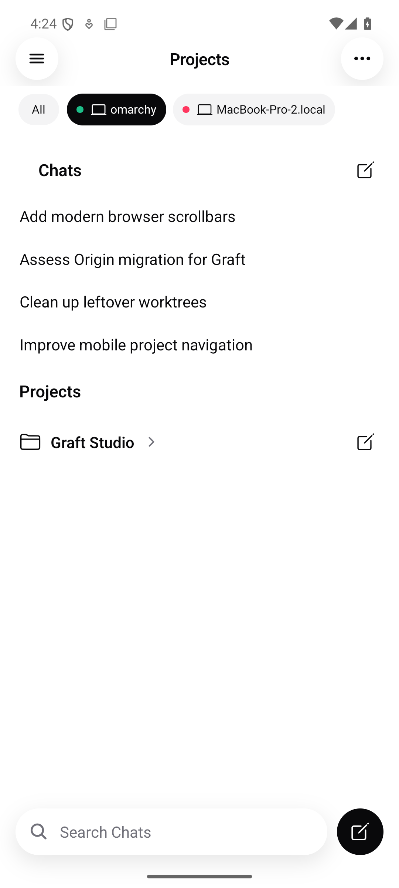
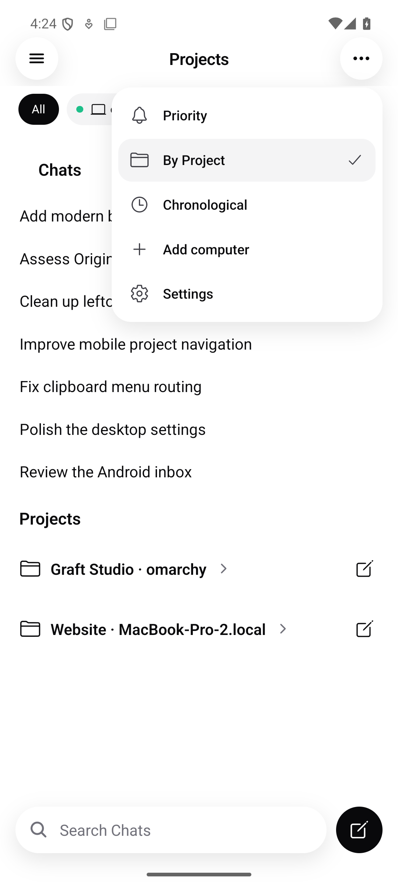

# Mobile multi-computer follow-up

PR 70 now retains an independent gateway, snapshot, command queue, and chat state
for each paired computer on both iOS and Android. Selecting a filter changes the
inbox presentation without switching or replacing a connection.

## Behavior

- Projects shows All followed by computer chips, matching the supplied reference:
  filled capsules, laptop icons, and green connected/red unavailable dots.
- All includes projects, standalone Chats, recents, Priority, Chronological, and
  search results across computers. Computer filters apply to all those views.
- Projects → ⋯ → Add computer and Settings → Computers → Add computer open the
  existing QR/pairing-link flow. Studio provides the code/link under Settings →
  Mobile Pairing. Removing one pairing leaves the other connections intact.
- Starting a generic chat in All asks which computer to use. Opening an existing
  thread or a project's compose action routes commands to its owning computer.
- Read receipts, expanded project IDs, caches, and routes are scoped by computer.
  Identical project/thread IDs on two computers cannot share chat state or commands.
- A sleeping/offline computer retains cached projects and previously opened
  transcripts. Its red dot replaces stale work/loading indicators; routine
  reachability failures do not show warning banners. Explicit authentication,
  authorization, and protocol errors still surface. Live work resumes after reconnect.
- Re-pairing replaces only that computer's runtime. Late replies and revocations
  from the prior session cannot overwrite or delete the replacement pairing.

## Validation

- Android: 281 tests across 49 files pass. Coverage includes two mounted runtimes,
  command routing, cached offline relaunch, removal/re-pair races, snapshot and
  welcome ownership, filtered/combined views, unread isolation, and quiet offline
  presentation versus explicit errors.
- Android TypeScript checks and Expo Android/Hermes export pass. Export is a bundle
  check, not a Gradle build or an on-device test.
- iOS: 15 focused XCTest cases were added for ownership, cache isolation, offline
  activity, transport classification, and session replacement/revocation. They
  have not run on this Linux host. The 43 checked-in protocol fixtures are in sync;
  protocol-fixture and local-network ATS Node checks pass.
- Workspace formatting, lint (zero errors), all 12 typecheck tasks, and migration
  lineage checks pass.
- Full `bun run test`: 12,147 passed, 11 failed, 32 skipped in the initial full run.
  Ten failures came from Git tests assuming different global `diff.mnemonicPrefix`
  and `pull.rebase` settings. All 143 tests in that file pass with test-process-only
  overrides (`false` for both); user Git settings were not changed. The remaining
  terminal test assumes `/bin/bash` while this host uses `/usr/bin/bash`; its
  54-test file passes separately with `SHELL=/bin/bash`. Server source and
  tests are unchanged from the previous PR head. The final Android suite adds
  four passing tests beyond the initial workspace run.

## Android screenshots

Refreshed September 21, 2026 on the available Android 15 emulator (1080 × 2400),
rendering the reference-matched filter follow-up to PR 70 with an isolated component harness
and sample snapshots. These are native emulator screenshots, not mockups
or screenshots from the earlier inbox implementation.

| Selected computer                                                                 | Add computer menu                                            |
| --------------------------------------------------------------------------------- | ------------------------------------------------------------ |
|  |  |

[All computers](android-projects.png) shows the combined inbox.

[Offline computer filter](android-offline-filter.png) retains only that computer's
sample chats and project. Its sample threads have stale running status; no spinner
or warning appears. Selecting All restores the combined inbox. The computer row
scrolls horizontally when labels exceed the available width. The refreshed pills
use 12sp labels, 16dp laptop icons, 7dp teal/pink status dots, and 32dp visible fills.
Laptop-to-label spacing is 4dp; status dots have a separate 8dp gap. The row sits
closer to the header, with black selected and neutral unselected capsules.
Tap targets remain at least 48dp including horizontal hit slop on All.
Both sample computer names now fit completely at the captured screen width.
iOS uses the same compact proportions with caption text and 44pt tap targets;
its native rendering remains unverified while the Mac is offline. The five Android
HomeScreen tests pass after this refinement; tapping the connected computer, the
offline computer, and All was also checked in the emulator.

The Android SDK and running emulator were found outside the shell's PATH after
the initial validation pass. These captures use the existing isolated development
client (`studio.graft.mobile.chatcontrols`); no production pairing was changed.
The older client lacks `RNSVGPath`, so opening the pairing screen failed in that
client. A rebuilt client is still required to verify that screen. The screenshots
do not establish a live two-computer connection or verify the signed release.

## Native verification still required

Live device/session verdict: **INCONCLUSIVE**. Xcode and Swift remain unavailable
on the execution host, and the paired Mac is offline. No current iOS screenshots
were captured. The native iOS build and the complete Android pairing/runtime flow
still need verification.

On iPhone, iPad, and Android: pair two Studios; confirm both continue receiving
updates while changing All/computer filters; open same-ID threads and send to
each owner; switch one Studio off with its thread open; verify a red dot, cached
history, no stale spinner, and no offline warning; restart the app while it is
still offline; reconnect; then remove/re-pair one computer while the other keeps
streaming. Also check Dynamic Type/font scaling, VoiceOver/TalkBack chip labels,
and dark mode against the supplied reference.
