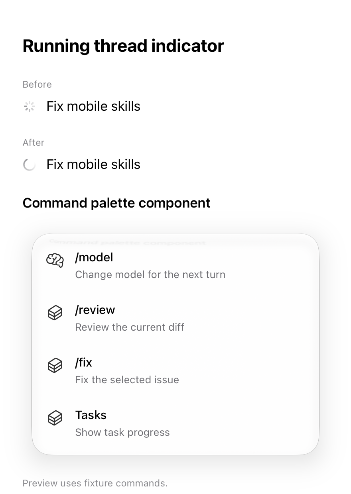

# Mobile slash commands, live titles, and activity indicator

[Watch the indicator comparison](ios-indicator.mp4).

The image and video are native simulator component captures. The first row uses
the previous `ProgressView`; the second renders the updated
`InboxThreadActivityIndicator`. The command palette uses fixture commands. These
captures demonstrate appearance and motion, not live provider discovery.

An iPhone simulator check also confirmed that typing `/` in New Chat opens the
palette above the composer. Its paired host was offline, so that check could not
verify populated skills or end-to-end execution. Android menu regression tests
exercise project/provider discovery, filtering, insertion, and stale results.

The native validation covers slash completion, snapshot title reconciliation,
protocol fixtures, and inbox grouping (102 tests). A temporary component capture
harness produced the media above and was removed after capture. An earlier,
separate transcript-position visual test failed while locating its transcript
marker, before slash interaction; this layout assertion remains unverified.

New-chat discovery requires updated mobile clients and a Studio host that accepts
project-scoped `composer.commands` requests. Existing-thread requests keep their
thread context. No hosted service or installed production app was updated.
