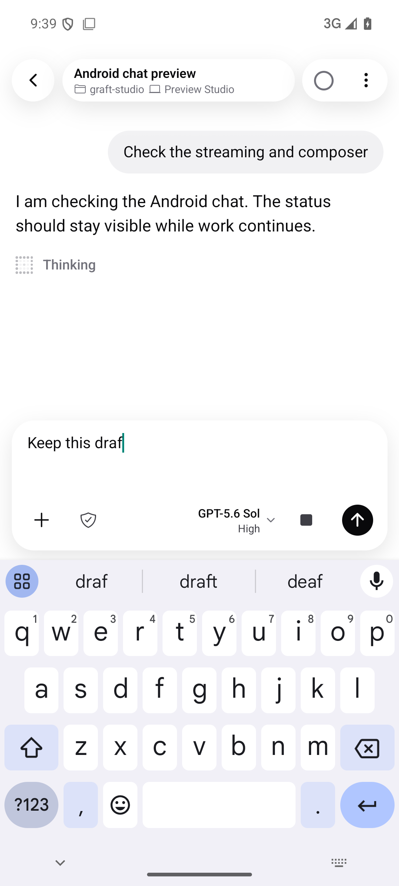
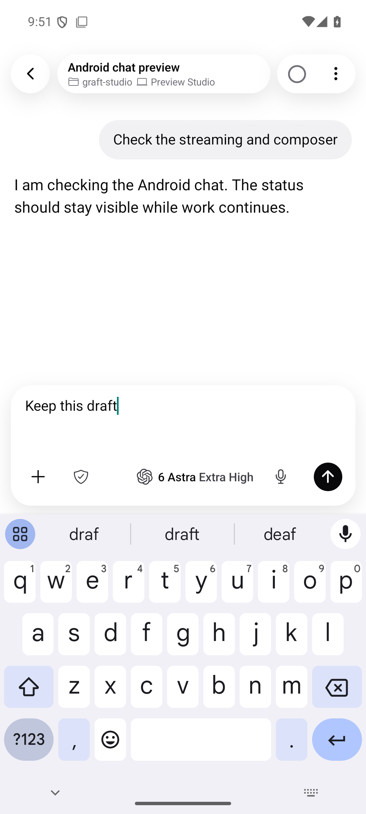
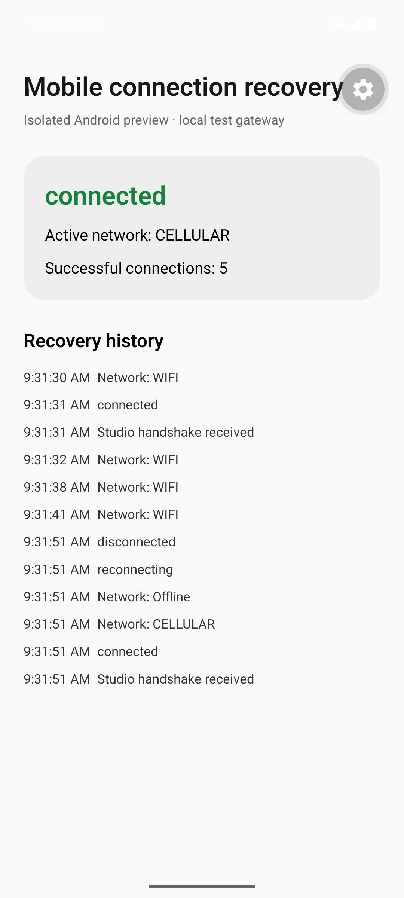

# Mobile chat and connection recovery evidence

Captured on an Android emulator using isolated previews and synthetic conversation
data. The production app entry point was restored after verification.

## Composer and thinking

The earlier iteration put effort below the model. The final composer keeps model
and effort on one line inside the input surface, including with the keyboard open.
The earlier screenshot is an intermediate implementation, not the original main
branch UI. It shows an active response; the final screenshot shows an idle draft.

| Earlier iteration                                         | Final composer                                      |
| --------------------------------------------------------- | --------------------------------------------------- |
|  |  |

[Thinking shimmer recording](thinking-shimmer.mp4). The recording demonstrates the
status animation before the final composer layout correction; use the final
screenshot to review the composer.

## Connection recovery

The native preview used the actual Android gateway socket and Expo network watcher
against a local test gateway. Wi-Fi to cellular, offline to cellular, cellular to
Wi-Fi, and background to foreground recovery completed without re-pairing. The
resume cursor remained 10 across reconnects.

A dropped application pong closed the stale connection after 10.018 seconds; the
replacement handshake completed 0.821 seconds later. The same four focused recovery
tests failed against the original socket implementation and passed with the fix.

This verifies native Android callbacks and client recovery in an emulator. It does
not verify a physical carrier or the production relay. iOS recovery tests were
added but require Xcode to run. Cellular access still requires a reachable relay,
HTTPS host, or tailnet; a LAN-only pairing cannot work away from that LAN.
