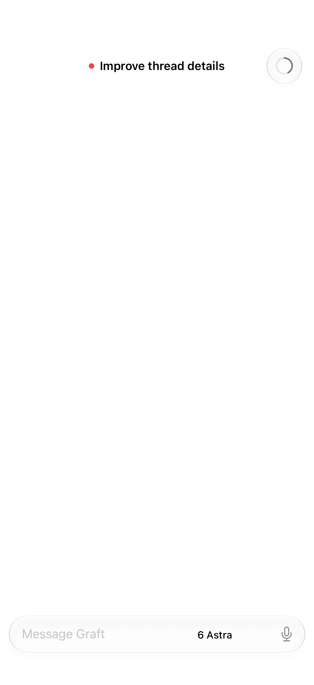
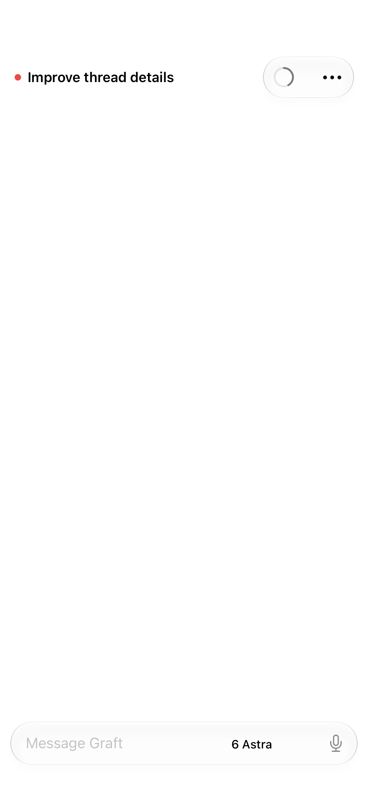
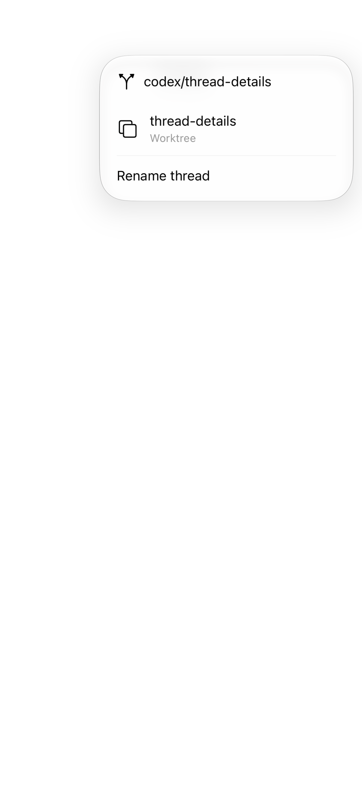
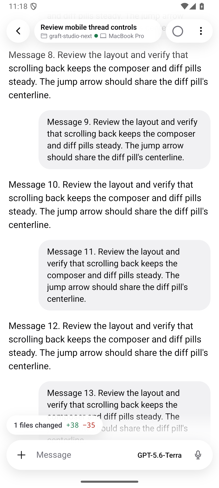
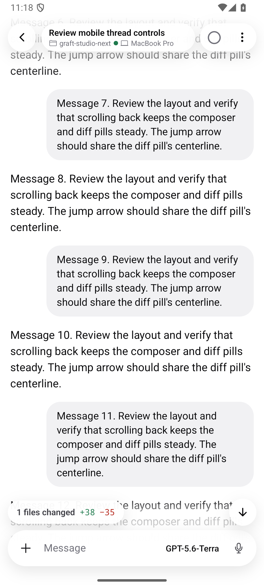

# Mobile thread menu and chrome review

All captures use synthetic threads. No personal conversation content is included.

## iOS toolbar: main versus this change

The same hosted SwiftUI fixture shows main's context button and the new grouped
context/ellipsis controls. The baseline is `5cade3e72` (PR #77); the after capture
uses this branch with that commit integrated. These are simulator-hosted view
captures, not physical-device screenshots.

| Before                                            | After                                                        |
| ------------------------------------------------- | ------------------------------------------------------------ |
|  |  |

The connected menu content has only the branch, short workspace/worktree name,
and thread rename action:

Eight native tests cover menu sizes, toolbar presentation, rename failure/retry,
and stable scroll-control geometry with and without diff/task accessories at
390/440-point widths and large/accessibility text sizes. Hosted geometry captures
show transcript text through glass accessories; the tests establish positioning,
not perfect background readability in every capture.

## Android scrolling interaction

These emulator captures show the implemented gradient fade and arrow behavior
before and after scrolling, rather than a comparison against old source code.
The arrow appears beside the diff pill without moving the composer or pill row.

| Before scrolling                           | After scrolling                                           |
| ------------------------------------------ | --------------------------------------------------------- |
|  |  |

[Watch scrolling and the light/dark fade](android-scroll.mp4).

The Android recording was captured during implementation, before the later main
sync added the composer permissions control. It demonstrates the unchanged fade
and scroll controls; it is not a recording of the final integrated APK. The
integrated source passes all 300 Android tests and workspace typecheck. A local
EAS preview built against `c1b4b5ea9` plus these mobile changes was signed and
cold-launched on an API 36 emulator without Metro. PR #77 was integrated afterward
and is included in the latest iPhone build, but not that existing APK.
